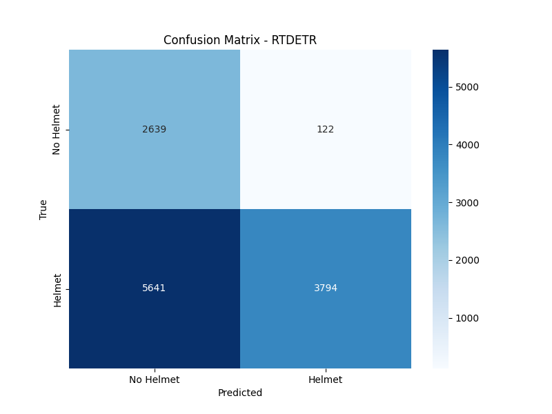
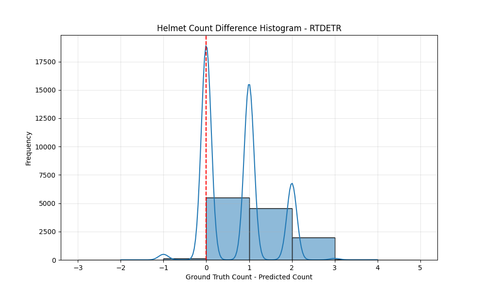

# Model Performance Report: RTDETR

## Classification Metrics (Helmet Presence)

- Accuracy: 0.5275
- Precision: 0.9688
- Recall: 0.4021
- F1 Score: 0.5683
- ROC AUC: 0.6790

### Confusion Matrix

## Count Metrics (Number of Helmets)

- Mean Squared Error (MSE): 1.0590
- Mean Absolute Error (MAE): 0.7161
- Root Mean Squared Error (RMSE): 1.0291
- Count Accuracy (Exact Match): 0.4520

### Count Prediction Analysis

- Total images: 12196
- Correct predictions: 5513 (45.20%)
- Under predictions: 6540 (53.62%)
- Over predictions: 143 (1.17%)

### Count Difference Histogram

