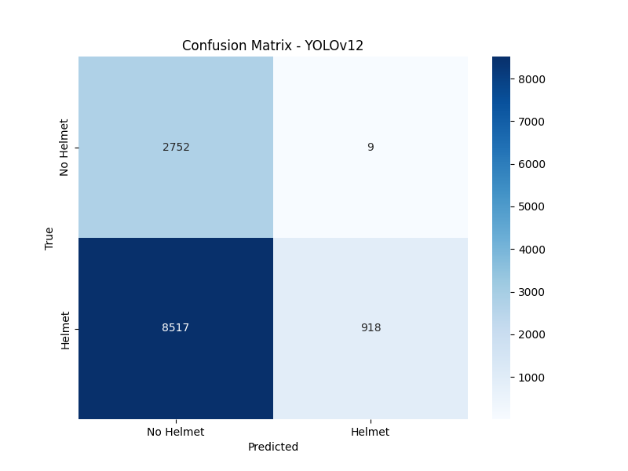
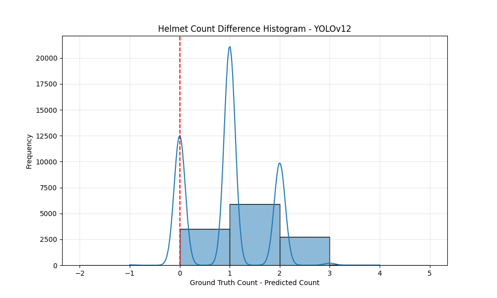

# Model Performance Report: YOLOv12

## Classification Metrics (Helmet Presence)

- Accuracy: 0.3009
- Precision: 0.9903
- Recall: 0.0973
- F1 Score: 0.1772
- ROC AUC: 0.5470

### Confusion Matrix

## Count Metrics (Number of Helmets)

- Mean Squared Error (MSE): 1.4279
- Mean Absolute Error (MAE): 0.9489
- Root Mean Squared Error (RMSE): 1.1950
- Count Accuracy (Exact Match): 0.2859

### Count Prediction Analysis

- Total images: 12196
- Correct predictions: 3487 (28.59%)
- Under predictions: 8699 (71.33%)
- Over predictions: 10 (0.08%)

### Count Difference Histogram

