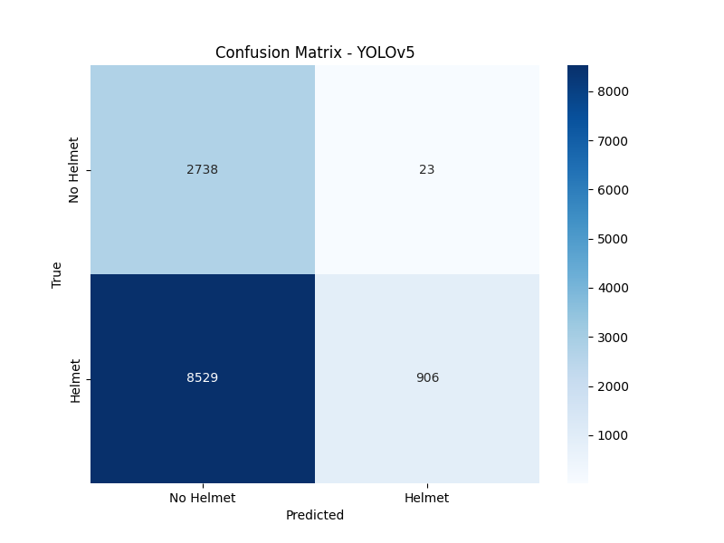
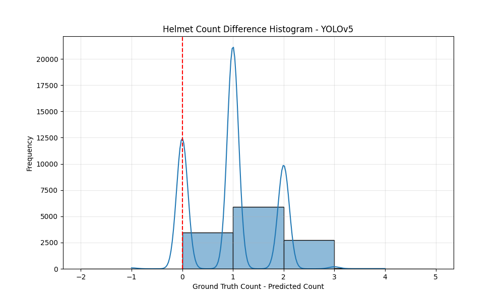

# Model Performance Report: YOLOv5

## Classification Metrics (Helmet Presence)

- Accuracy: 0.2988
- Precision: 0.9752
- Recall: 0.0960
- F1 Score: 0.1748
- ROC AUC: 0.5438

### Confusion Matrix

## Count Metrics (Number of Helmets)

- Mean Squared Error (MSE): 1.4286
- Mean Absolute Error (MAE): 0.9506
- Root Mean Squared Error (RMSE): 1.1952
- Count Accuracy (Exact Match): 0.2839

### Count Prediction Analysis

- Total images: 12196
- Correct predictions: 3463 (28.39%)
- Under predictions: 8710 (71.42%)
- Over predictions: 23 (0.19%)

### Count Difference Histogram

