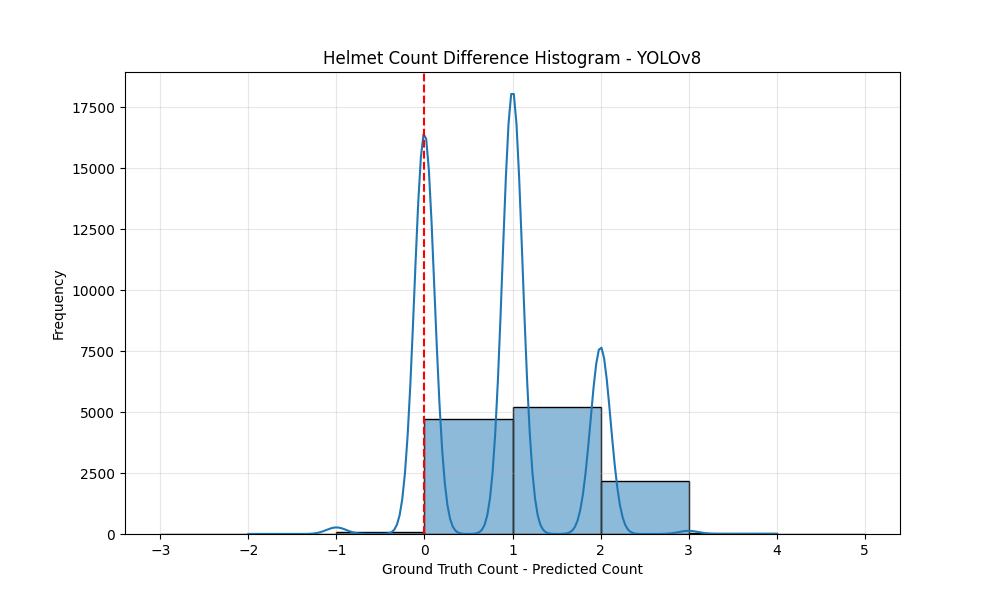

# Model Performance Report: YOLOv8

## Classification Metrics (Helmet Presence)

- Accuracy: 0.4408
- Precision: 0.9756
- Recall: 0.2843
- F1 Score: 0.4402
- ROC AUC: 0.6300

### Confusion Matrix

## Count Metrics (Number of Helmets)

- Mean Squared Error (MSE): 1.1791
- Mean Absolute Error (MAE): 0.8008
- Root Mean Squared Error (RMSE): 1.0859
- Count Accuracy (Exact Match): 0.3851

### Count Prediction Analysis

- Total images: 12196
- Correct predictions: 4697 (38.51%)
- Under predictions: 7421 (60.85%)
- Over predictions: 78 (0.64%)

### Count Difference Histogram

