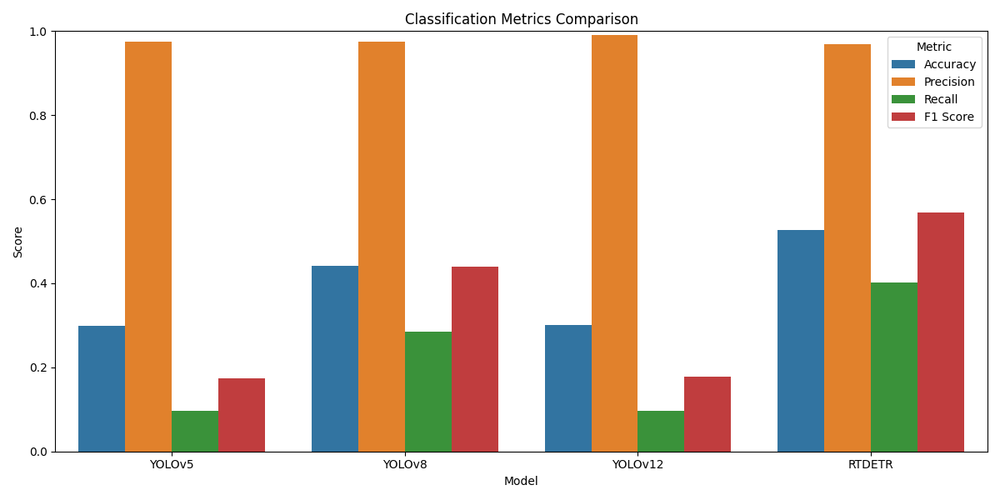
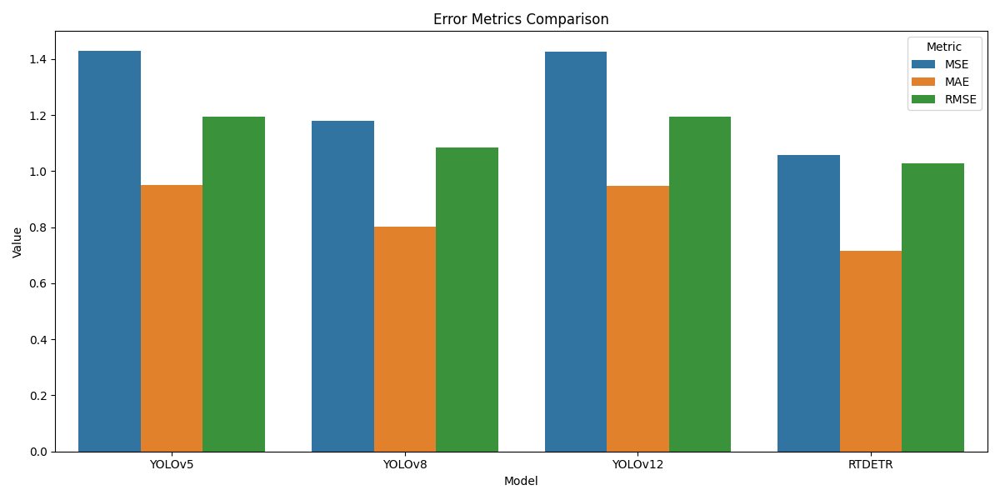
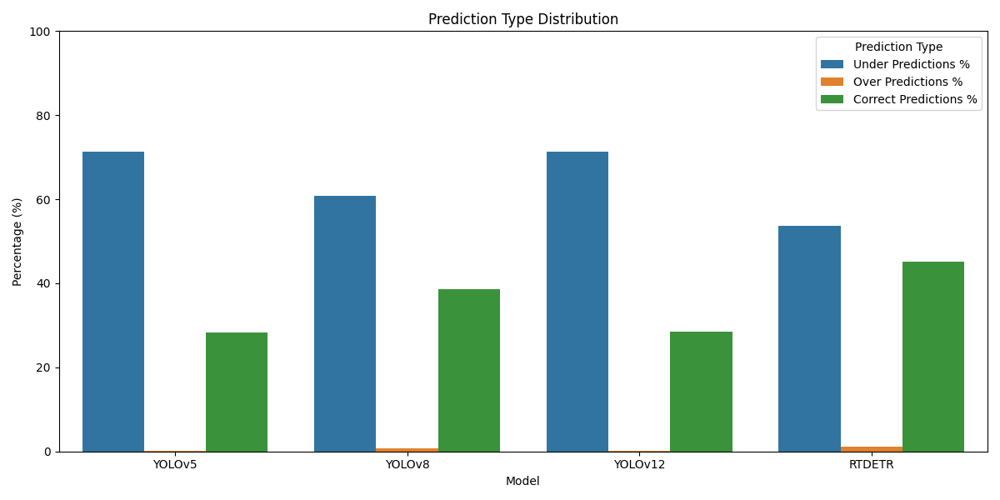

# Model Comparison Report

## Classification Metrics Comparison

| Model   |   Accuracy |   Precision |    Recall |   F1 Score |   ROC AUC |
|:--------|-----------:|------------:|----------:|-----------:|----------:|
| YOLOv5  |   0.298786 |    0.975242 | 0.0960254 |   0.174836 |  0.543848 |
| YOLOv8  |   0.4408   |    0.975628 | 0.284261  |   0.44025  |  0.629997 |
| YOLOv12 |   0.300918 |    0.990291 | 0.0972973 |   0.177186 |  0.547019 |
| RTDETR  |   0.527468 |    0.968846 | 0.40212   |   0.568347 |  0.678966 |

## Count Metrics Comparison

| Model   |     MSE |      MAE |    RMSE |   Count Accuracy |   Under Predictions % |   Over Predictions % |   Correct Predictions % |
|:--------|--------:|---------:|--------:|-----------------:|----------------------:|---------------------:|------------------------:|
| YOLOv5  | 1.42858 | 0.950558 | 1.19523 |         0.283946 |               71.4169 |            0.188586  |                 28.3946 |
| YOLOv8  | 1.17908 | 0.800754 | 1.08585 |         0.385126 |               60.8478 |            0.639554  |                 38.5126 |
| YOLOv12 | 1.42793 | 0.948918 | 1.19496 |         0.285913 |               71.3267 |            0.0819941 |                 28.5913 |
| RTDETR  | 1.05895 | 0.716054 | 1.02905 |         0.452033 |               53.6241 |            1.17252   |                 45.2033 |

## Model Rankings (1 = Best)

| Model   |   Accuracy Rank |   Precision Rank |   Recall Rank |   F1 Score Rank |   ROC AUC Rank |   MSE Rank |   MAE Rank |   RMSE Rank |   Count Accuracy Rank |   Correct Predictions % Rank |   Average Rank |
|:--------|----------------:|-----------------:|--------------:|----------------:|---------------:|-----------:|-----------:|------------:|----------------------:|-----------------------------:|---------------:|
| RTDETR  |               1 |                4 |             1 |               1 |              1 |          1 |          1 |           1 |                     1 |                            1 |            1.3 |
| YOLOv8  |               2 |                2 |             2 |               2 |              2 |          2 |          2 |           2 |                     2 |                            2 |            2   |
| YOLOv12 |               3 |                1 |             3 |               3 |              3 |          3 |          3 |           3 |                     3 |                            3 |            2.8 |
| YOLOv5  |               4 |                3 |             4 |               4 |              4 |          4 |          4 |           4 |                     4 |                            4 |            3.9 |

## Conclusion

Based on the average ranking across all metrics, **RTDETR** performs the best overall.

